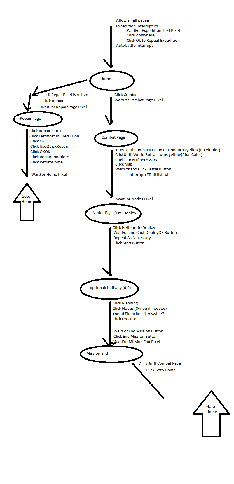

# LFGm

## Description
An automated script including GUI to assist in automating dailies in mobile gacha games.  
Uses public-library optical recognition functions to recognize states of an Android virtual machine running in the background, then uses control injection to manipulate the virtual machine still in the background in order to complete automation without requiring user interruption or losing window focus of user's foreground window.
Typically one to two gacha games focused on at a time, with the particular gacha games shifting over the years.
LFGmAK for Arknights, LFGmCS for Counter:Side, LFGmMagicami for Magicami.  Some functions for BDSM (Battle Divas Slay Mechas) and AE (Another Eden).
## ScreenShots
(BDSM refers to the mobile gacha game Battle Divas: Slay Mecha)  
  
  
  
Logic Flow Sketch for Arknights Main Repeat loop:  

## Links(Optional)

## Technologies used
AutoHotKey  
Nox Android Emulator, then switched to LD Player Android Emulator

## Credits
FindClick.ahk: https://autohotkey.com/boards/viewtopic.php?f=6&t=18719  
Gdip_All.ahk + Gdip_ImageSearch.ahk: http://www.autohotkey.com/board/topic/71100-gdip-imagesearch/
